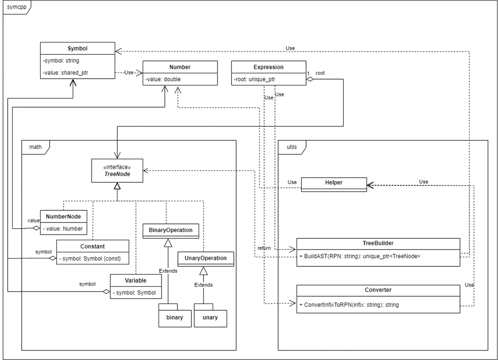
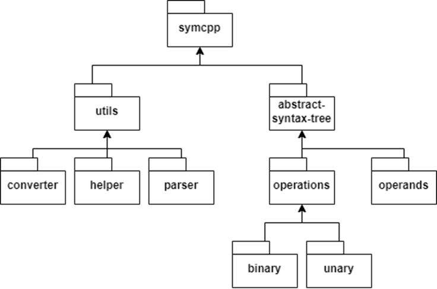

# SymCpp

Yet another C++ library for symbolic mathematical calculations

## Usage Example

```cpp
Symbol x('x'), y('y');
Symbol& z(x);  // alias for x
Number num = 17;

Expression exp("x + ln(y^2)", {x, y});  // exp = x + ln(y ^ 2)
exp = Pow(x, 2) * 13 + Sin(pi * y);     // exp = x ^ 2 * 13 + sin(pi * y)

x = 3;        // exp = 3 ^ 2 * 13 + sin(pi * y)
y = num / 2;  // exp = 3 ^ 2 * 13 + sin(pi * 8.5)

Number result = exp;  // result = 118

x.Reset();  // exp = x ^ 2 * 13 + sin(pi * 8.5)
y.Reset();  // exp = x ^ 2 * 13 + sin(pi * y)

auto derivative_of_func_x = Diff(exp, x);  // f'x(x,y) = 2 * x * 13
auto derivative_of_func_y = Diff(exp, y);  // f'y(x,y) = cos(pi * y) * pi

Number result_2 = Evaluate(exp, {{x, 14}, {y, 17}});  // result_2 = 7.843064

RPN(exp + Log(Pow(x, y)))    // x 2 ^ 13 * pi y * sin + x y ^ ln + (reverse polish notation)
Latex(exp + Log(Pow(x, y)))  // {x} ^ {2} * 13 + \sin\left(pi * y\right) + \ln\left({x} ^ {y}\right)
```

## Building the Library

```shell
mkdir build
cd build
cmake .. -DCMAKE_BUILD_TYPE=Release
cmake --build . --target SYMCPP
```

## Building the Examples

```shell
mkdir build
cd build
cmake .. -DCMAKE_BUILD_TYPE=Release
cmake --build . --target simple
cmake --build . --target tangent_builder
cmake --build . --target interactive_calc
```

## Running the Examples

#### Example from README
```shell
./build/simple
```

#### Tangent Builder

```shell
./build/tangent_builder
```

#### Usage in interactive mode

```shell
./build/interactive_calc
```

## Docs

##### Description

[SymCpp - library for symbolic mathematical calculations.pdf](doc/SymCpp%20-%20library%20for%20symbolic%20mathematical%20calculations.pdf)

##### Class Diagram



##### Structure

